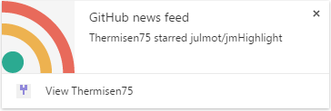
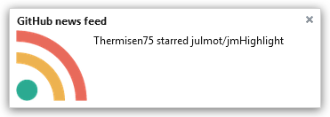

# [][installation] News Feed for GitHub
> GitHub news feed notifications directly in the browser

Chrome:  
[][chrome-download-link]

Firefox:  
[][firefox-download-link]

## Installation

- [Firefox add-ons marketplace][firefox-download-link]
- [Chrome add-ons marketplace][chrome-download-link]
- Download a release [directly][release-link]

[installation]: https://github.com/julmot/news-feed-for-github#installation
[firefox-download-link]: https://addons.mozilla.org/en-US/firefox/addon/news-feed-for-github/
[chrome-download-link]: https://addons.mozilla.org/en-US/firefox/addon/news-feed-for-github/
[release-link]: https://github.com/julmot/news-feed-for-github/releases "Releases"
